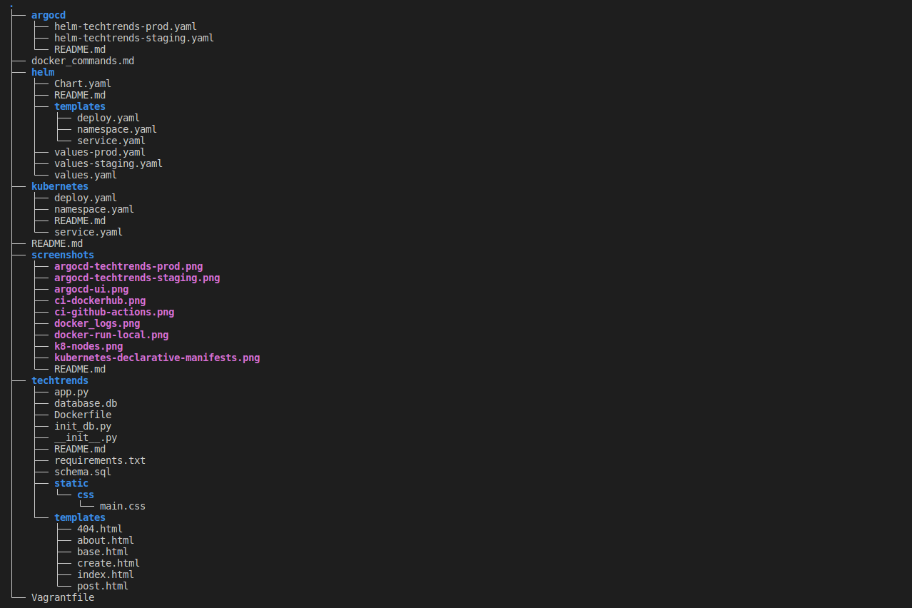

# TechTreds Web Application

## Overview

This project (TechTrends) is about an online website used as a news sharing platform, enabling consumers to access the latest news within the cloud-native ecosystem. In addition to accessing the available articles, readers can create new media articles and are also able to share them.

The initial starter code for the project is [here](https://github.com/udacity/nd064_course_1/tree/main/project/techtrends).

## Project Directories and Files

## Dockerizing the Application

The application was packaged using Docker and the final image for deployment is shared in DockerHub. For details on this process. Check relevant docker commands used in

`docker-commands.md`

## Continuos Integration was followed in developing the app via GitHub Actions.

Check `.github` folder for the .yml configuration file for the CI pipeline.

## App Deployment in Kubernetes cluster

The app is deployed using kubernetes declarative deployment approach.
The associated kubernetes declarative manifests are in the directory- `kubernetes`

## Continuous Delivery (CD)

Cloud native CD approach was employed in the project. This was realized by using the files in `helm` and ` argocd` directories
