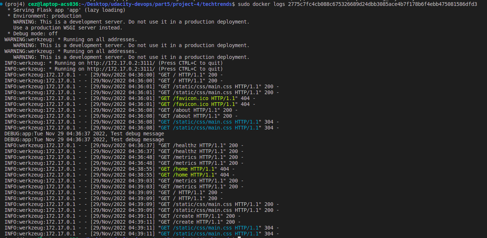

## Docker commands used to build the application 


```docker build -t techtrends .```

## Docker commands used to run the application

```docker run -d -p 7111:3111 techtrends```

## Docker commands used to get the application logs

```docker logs 2775c7fc4cb088c675326689d24dbb3085ace4b7f178b6f4ebb475081586dfd3```  

where 2775c7fc4cb088c675326689d24dbb3085ace4b7f178b6f4ebb475081586dfd3 is the CONTAINER_ID

## Logs from the container running the TechTrends application



## docker commands to tag the image

```docker tag techtrends  ezecc/techtrends:v1.0.0```

## docker commands to push the image

```sudo docker push ezecc/techtrends:v1.0.0```
